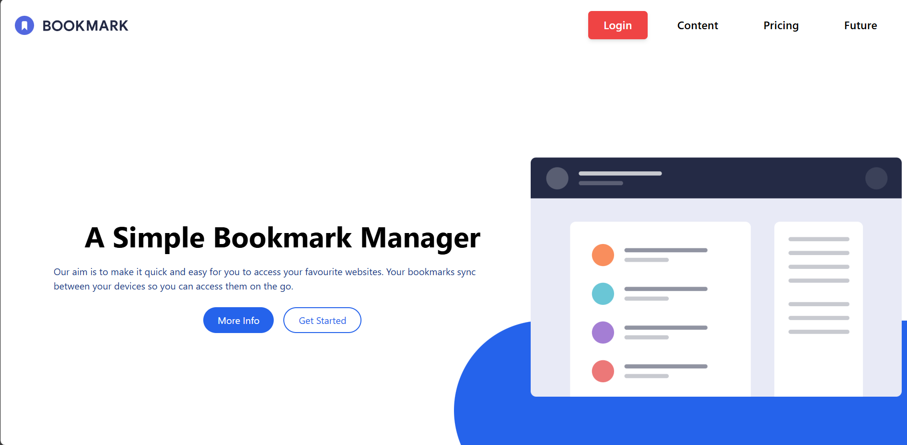

# Bookmark Manager Landing Page

<h4 align="center">A responsive landing page for a bookmark manager built with React and Tailwind CSS.</h4>

<p align="center">
  <a href="#features">Features</a> •
  <a href="#getting-started">Getting Started</a> •
  <a href="#project-structure">Project Structure</a> •
  <a href="#design-features">Design Features</a> •
  <a href="#technologies-used">Technologies Used</a> •
  <a href="#future-enhancements">Future Enhancements</a> •
  <a href="#license">License</a>
</p>

<p align="center">
  
</p>

---

## ✨ Features

- 🔥 **Hero Section**
  - Eye-catching layout with modern typography and CTAs
- 🚀 **Features Section**
  - Tabbed interface showcasing product highlights
- 💾 **Download Section**
  - Stylish cards for browser extension download
- ❓ **FAQ Section**
  - Interactive accordion for user questions
- 📱 **Responsive Navigation**
  - Fully mobile-optimized navbar
- 🔚 **Footer**
  - Clean footer with social links and useful resources

---

## 💻 Getting Started

To run this project locally, you'll need [Node.js](https://nodejs.org/) and [npm](https://www.npmjs.com/) installed.

```bash
# Install dependencies
npm install

# Start the development server
npm run dev
```

---

## 🛠️ Local Development Setup

Follow these steps to run this project on your local machine:

1. **Prerequisites**
   - Node.js (version 16 or higher)
   - npm (comes with Node.js)
   - Git

2. **Clone the Repository**
   ```bash
   git clone https://github.com/FarmanOthman/Tailwind-Challenges/tree/main/challenge-02
   cd challenge-02
   ```

3. **Install Dependencies**
   ```bash
   npm install
   ```

4. **Environment Setup**
   - No additional environment variables are required for this project

5. **Development Server**
   ```bash
   npm run dev
   ```
   This will start the development server at `http://localhost:5173`

6. **Build for Production**
   ```bash
   npm run build
   ```
   The build output will be in the `dist` folder

7. **Common Issues & Solutions**
   - If you encounter EACCES errors during npm install, try running with sudo (Linux/Mac)
   - For port conflicts, the Vite dev server will automatically try the next available port
   - Make sure all required dependencies are properly installed

8. **Available Scripts**
   - `npm run dev` - Start development server
   - `npm run build` - Build for production
   - `npm run preview` - Preview production build locally

---

## 📁 Project Structure

```
src/
├── Components/
│   ├── Nav.jsx                  # Navigation component
│   ├── Hero.jsx                 # Hero section
│   ├── Features.jsx             # Features showcase
│   ├── DownloadTheExtension.jsx # Download section
│   ├── QAsection.jsx            # FAQ accordion
│   └── Footer.jsx               # Footer component
├── assets/
│   └── images/                  # Project illustrations
└── App.jsx                      # Main application entry
```

---

## 🎨 Design Features

- **Color Scheme**
  - Primary: `#2563eb` (Tailwind Blue-600)
  - Text: Dark blue
  - Background: Clean white layout

- **Typography**
  - Bold headers for clarity
  - Legible body content
  - Consistent padding and spacing

- **Interactions**
  - Hover/scale animations on buttons
  - Smooth transitions for better UX
  - Fully responsive for mobile/tablet/desktop

---

## 🧰 Technologies Used

- ⚛️ React + Vite
- 🎨 Tailwind CSS
- 🔀 React Router (if applicable)
- 🖼️ SVG Illustrations

---

## 🚧 Future Enhancements

- 🌙 Dark mode support
- 🌀 Add entry animations and transitions
- ✅ Form validation
- 📱 Enhance mobile menu UI
- ⚡ Performance optimizations

---

## 📚 Learning Outcomes

- Flexbox-based responsive layout
- Real-world component structuring
- Creating reusable sections in React
- Animation and interactivity using Tailwind
- Clean code and best practices

---

## 🧾 License

This project is licensed under the MIT License - see below for details:

```
MIT License

Copyright (c) 2025

Permission is hereby granted, free of charge, to any person obtaining a copy
of this software and associated documentation files (the "Software"), to deal
in the Software without restriction, including without limitation the rights
to use, copy, modify, merge, publish, distribute, sublicense, and/or sell
copies of the Software, and to permit persons to whom the Software is
furnished to do so, subject to the following conditions:

The above copyright notice and this permission notice shall be included in all
copies or substantial portions of the Software.

THE SOFTWARE IS PROVIDED "AS IS", WITHOUT WARRANTY OF ANY KIND, EXPRESS OR
IMPLIED, INCLUDING BUT NOT LIMITED TO THE WARRANTIES OF MERCHANTABILITY,
FITNESS FOR A PARTICULAR PURPOSE AND NONINFRINGEMENT. IN NO EVENT SHALL THE
AUTHORS OR COPYRIGHT HOLDERS BE LIABLE FOR ANY CLAIM, DAMAGES OR OTHER
LIABILITY, WHETHER IN AN ACTION OF CONTRACT, TORT OR OTHERWISE, ARISING FROM,
OUT OF OR IN CONNECTION WITH THE SOFTWARE OR THE USE OR OTHER DEALINGS IN THE
SOFTWARE.
```

---

> Made with ❤️ using React and Tailwind CSS

---
