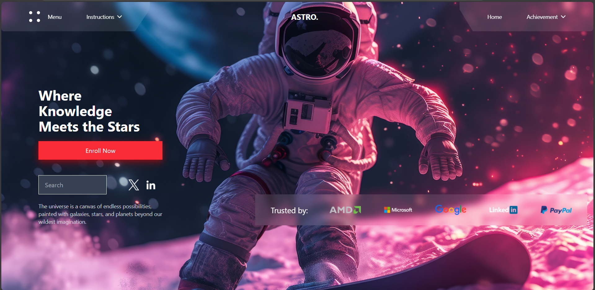

# 🌟 Educational Platform Landing Page

A modern, space-themed educational platform landing page focusing on astronomy and knowledge sharing. Features a sleek dark theme, social media integration, and a trusted partner showcase.

<p align="center">
  <a href="#features">Features</a> •
  <a href="#getting-started">Getting Started</a> •
  <a href="#project-structure">Project Structure</a> •
  <a href="#design-features">Design Features</a> •
  <a href="#technologies-used">Technologies Used</a> •
  <a href="#future-enhancements">Future Enhancements</a> •
  <a href="#learning-outcomes">Learning Outcomes</a> •
  <a href="#license">License</a>
</p>

<p align="center">
  
</p>

---

## Features

- 🌌 **Hero Section**
  - Engaging space-themed headline with call-to-action (CTA)
- 🛰️ **Search Integration**
  - Custom search field for easy navigation
- 🌍 **Partner Showcase**
  - Display trusted partners like AMD, Microsoft, etc.
- 📱 **Responsive Design**
  - Mobile-first approach with smooth breakpoints
- 🌑 **Dark Theme**
  - Space-inspired dark mode for immersive experience
- 🌐 **Social Integration**
  - Connect with platforms like Twitter and LinkedIn

---

## Getting Started

To run this project locally, you'll need [Node.js](https://nodejs.org/) and [npm](https://www.npmjs.com/) installed.

---

## Local Development Setup

Follow these steps to run this project on your local machine:

### Prerequisites
- Node.js (version 16 or higher)
- npm (comes with Node.js)
- Git

### Clone the Repository

```bash
git clone https://github.com/FarmanOthman/Educational-Platform.git
cd Educational-Platform
```

### Install Dependencies

```bash
npm install
```

### Environment Setup

No additional environment variables are required for this project.

### Development Server

```bash
npm run dev
```

This will start the development server at:

[http://localhost:5173](http://localhost:5173)

### Build for Production

```bash
npm run build
```

The build output will be in the `dist` folder.

### Common Issues & Solutions

- If you encounter EACCES errors during `npm install`, try running with `sudo` (Linux/Mac).
- For port conflicts, the Vite dev server will automatically try the next available port.
- Make sure all required dependencies are properly installed.

### Available Scripts

- `npm run dev` - Start development server
- `npm run build` - Build for production
- `npm run preview` - Preview production build locally

---

## Project Structure

```bash
src/
├── Components/
│   ├── Hero.jsx          # Hero section with CTA and headline
│   ├── Navbar.jsx        # Navigation bar component
│   ├── Search.jsx        # Search section with input field
│   ├── Partners.jsx      # Trusted partners showcase
│   ├── Social.jsx        # Social media integration
│   └── Footer.jsx        # Footer component with links
├── assets/
│   └── images/           # Partner logos and other assets
└── App.jsx               # Main application entry point
```

---

## Design Features

### Color Scheme
- **Primary:** Dark theme (space-inspired)
- **Accent:** Red (#ef4444) for CTA and highlights
- **Text:** White and shades of gray for legibility
- **Background:** Deep space-inspired gradients and dark tones

### Typography
- Bold, clear headings for the space theme
- Clean, readable body text for knowledge sharing

### Visual Effects
- Glassmorphism (backdrop-blur) for modern UI
- Subtle button glow effects for interactivity
- Smooth scaling and transitions for responsiveness

### Interactions
- Hover effects on buttons and links
- Fluid mobile-to-desktop scaling

---

## Technologies Used

- ⚛️ React + Vite
- 🎨 Tailwind CSS
- 🔀 React Router
- 🖼️ SVG Icons and Assets

---

## Future Enhancements

- 🌙 Add a light mode/dark mode toggle
- 🚀 Enhance animations for smoother UX
- 🎓 Implement course catalog and filter
- 🔐 User authentication for personalized content

---

## Learning Outcomes

- Tailwind CSS for dark mode and responsive design
- Advanced component structuring in React
- Implementing smooth animations and interactivity
- Organizing SVG assets and using them in React
- Learning about glassmorphism and other modern UI patterns

---

## License

This project is licensed under the MIT License - see below for details:

```text
MIT License

Copyright (c) 2025

Permission is hereby granted, free of charge, to any person obtaining a copy
of this software and associated documentation files (the "Software"), to deal
in the Software without restriction, including without limitation the rights
to use, copy, modify, merge, publish, distribute, sublicense, and/or sell
copies of the Software, and to permit persons to whom the Software is
furnished to do so, subject to the following conditions:

The above copyright notice and this permission notice shall be included in all
copies or substantial portions of the Software.

THE SOFTWARE IS PROVIDED "AS IS", WITHOUT WARRANTY OF ANY KIND, EXPRESS OR
IMPLIED, INCLUDING BUT NOT LIMITED TO THE WARRANTIES OF MERCHANTABILITY,
FITNESS FOR A PARTICULAR PURPOSE AND NONINFRINGEMENT. IN NO EVENT SHALL THE
AUTHORS OR COPYRIGHT HOLDERS BE LIABLE FOR ANY CLAIM, DAMAGES OR OTHER
LIABILITY, WHETHER IN AN ACTION OF CONTRACT, TORT OR OTHERWISE, ARISING FROM,
OUT OF OR IN CONNECTION WITH THE SOFTWARE OR THE USE OR OTHER DEALINGS IN THE
SOFTWARE.
```

Made with ❤️ using React and Tailwind CSS.
