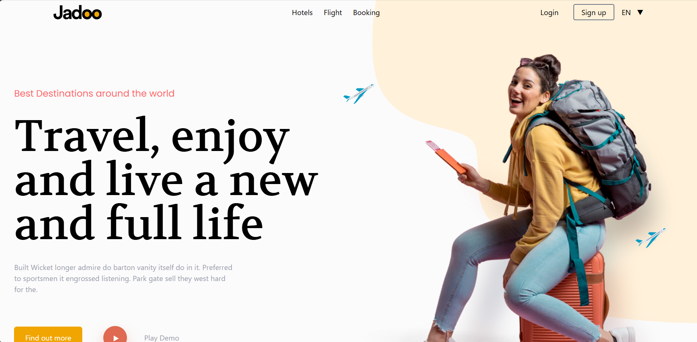

# ✈️ Challenge 04: Travel Website

A modern travel website featuring destinations, testimonials, and travel categories. Built with React and Tailwind CSS, focusing on beautiful UI and smooth user experience.

<p align="center">
  <a href="#features">Features</a> •
  <a href="#getting-started">Getting Started</a> •
  <a href="#local-development-setup">Local Development Setup</a> •
  <a href="#project-structure">Project Structure</a> •
  <a href="#design-features">Design Features</a> •
  <a href="#technologies-used">Technologies Used</a> •
  <a href="#future-enhancements">Future Enhancements</a> •
  <a href="#learning-outcomes">Learning Outcomes</a> •
  <a href="#license">License</a>
</p>

<p align="center">
  
</p>

---

## Features

- 🔥 **Hero Section**
  - Engaging travel-themed hero with animations
- 🌍 **Destinations**
  - Featured travel locations showcase
- 🗺️ **Categories**
  - Explore various travel categories
- ⚡ **Easy & Fast**
  - Feature highlights section
- 💬 **Testimonials**
  - Customer reviews and feedback
- 📧 **Newsletter**
  - Email subscription component
- 🏆 **Sponsor Section**
  - Trusted partner showcase
- 📱 **Responsive Design**
  - Mobile-first approach for smooth UX

---

## Getting Started

To run this project locally, you'll need [Node.js](https://nodejs.org/) and [npm](https://www.npmjs.com/) installed.

---

## Local Development Setup

Follow these steps to run this project on your local machine:

### Prerequisites
- Node.js (version 16 or higher)
- npm (comes with Node.js)
- Git

### Clone the Repository

```bash
git clone https://github.com/FarmanOthman/Travel-Website.git
cd Travel-Website
```

### Install Dependencies

```bash
npm install
```

### Environment Setup

No additional environment variables are required for this project.

### Development Server

```bash
npm run dev
```

This will start the development server at:

[http://localhost:5173](http://localhost:5173)

### Build for Production

```bash
npm run build
```

The build output will be in the `dist` folder.

### Common Issues & Solutions

- If you encounter EACCES errors during `npm install`, try running with `sudo` (Linux/Mac).
- For port conflicts, the Vite dev server will automatically try the next available port.
- Ensure all required dependencies are installed.

### Available Scripts

- `npm run dev` - Start development server
- `npm run build` - Build for production
- `npm run preview` - Preview production build locally

---

## Project Structure

```bash
src/
├── Components/
│   ├── Home/
│   │   ├── Hero.jsx          # Hero section
│   │   ├── Category.jsx      # Travel categories
│   │   ├── Destinations.jsx  # Featured destinations
│   │   ├── EasyAndFast.jsx   # Fast feature highlights
│   │   ├── Testimonials.jsx  # User feedback section
│   │   ├── Subscribe.jsx     # Newsletter signup
│   │   └── Sponsor.jsx       # Partner showcase
│   ├── Navbar/
│   ├── Footer/
│   ├── About/
│   └── NotFound/
├── assets/
│   └── Images/               # Partner logos and illustrations
└── App.jsx
```

---

## Design Features

### Color Scheme
- **Primary:** Orange (#FF7D68)
- **Secondary:** Red (#DF6951)
- **Text:** Dark gray and white

### Typography
- **Headlines:** Volkhov font
- **Body Text:** Poppins font
- **Large Hero Text**

### Visual Effects
- Custom illustrations
- Decorative shapes
- Animated elements (e.g., button animations)
- Responsive images for all screen sizes

---

## Technologies Used

- ⚛️ React + Vite
- 🎨 Tailwind CSS
- 🔠 Custom Fonts (Volkhov, Poppins)
- 🖼️ SVG Illustrations
- 🎥 CSS Animations

---

## Future Enhancements

- 🌟 Add search functionality
- 🏨 Implement booking system
- 🔒 Add user authentication
- 🌍 Create detailed destination pages
- 🗺️ Add interactive map
- 🌙 Implement dark/light mode toggle

---

## Learning Outcomes

- Component organization in React
- Advanced Tailwind CSS styling
- Responsive design techniques
- Custom font and SVG integration
- Smooth CSS animations and transitions
- Building a multi-section website layout

---

## License

This project is licensed under the MIT License - see below for details:

```text
MIT License

Copyright (c) 2025

Permission is hereby granted, free of charge, to any person obtaining a copy
of this software and associated documentation files (the "Software"), to deal
in the Software without restriction, including without limitation the rights
to use, copy, modify, merge, publish, distribute, sublicense, and/or sell
copies of the Software, and to permit persons to whom the Software is
furnished to do so, subject to the following conditions:

The above copyright notice and this permission notice shall be included in all
copies or substantial portions of the Software.

THE SOFTWARE IS PROVIDED "AS IS", WITHOUT WARRANTY OF ANY KIND, EXPRESS OR
IMPLIED, INCLUDING BUT NOT LIMITED TO THE WARRANTIES OF MERCHANTABILITY,
FITNESS FOR A PARTICULAR PURPOSE AND NONINFRINGEMENT. IN NO EVENT SHALL THE
AUTHORS OR COPYRIGHT HOLDERS BE LIABLE FOR ANY CLAIM, DAMAGES OR OTHER
LIABILITY, WHETHER IN AN ACTION OF CONTRACT, TORT OR OTHERWISE, ARISING FROM,
OUT OF OR IN CONNECTION WITH THE SOFTWARE OR THE USE OR OTHER DEALINGS IN THE
SOFTWARE.
```

Made with ❤️ using React and Tailwind CSS.
